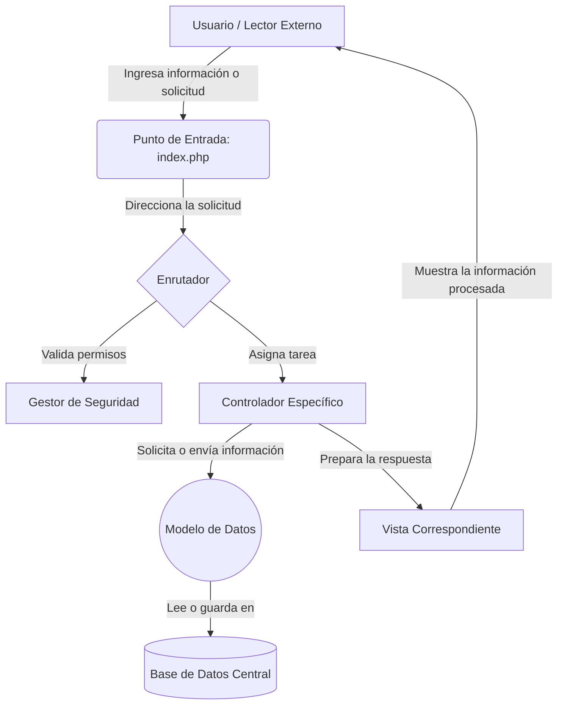

# Sistema de Control de Ingreso y Asistencia

Este documento presenta una descripción general del sistema de control de ingreso y asistencia. El propósito de este proyecto es administrar de manera eficiente la entrada, la asistencia, los aprendices, las excusas médicas y los usuarios involucrados en el proceso educativo.

## Estructura del Proyecto

El proyecto está organizado siguiendo el modelo de separación de responsabilidades para mantener el orden y facilitar su escalabilidad:

```text
/
|-- assets/         # Recursos visuales y de interacción (hojas de estilo, scripts, imágenes subidas).
|-- config/         # Configuraciones principales del sistema (conexión a la base de datos).
|-- controllers/    # Lógica de negocio que procesa las solicitudes de los usuarios.
|-- database/       # Archivos de la estructura y eventos de la base de datos.
|-- helpers/        # Funciones auxiliares de seguridad, validación y enrutamiento.
|-- migrations/     # Archivos de actualización de la base de datos.
|-- models/         # Representación de los datos y comunicación directa con la base de datos.
|-- views/          # Interfaces visuales donde interactúa el usuario.
|-- index.php       # Punto de entrada principal de la aplicación.
```

## Resumen Ejecutivo por Archivo

A continuación se detalla la función principal de cada uno de los archivos clave dentro de la estructura:

### Raíz
- **index.php**: Es el archivo principal que recibe todas las peticiones del sistema y las redirige hacia el área correspondiente.

### Configuración (`config/`)
- **Database.php**: Gestiona la conexión segura con la base de datos central donde reside toda la información.

### Controladores (`controllers/`)
- **AprendizController.php**: Administra la información relacionada con los aprendices (creación, edición y consulta).
- **AsistenciaController.php**: Gestiona el registro de la asistencia diaria, incluyendo la validación mediante dispositivos externos.
- **AuthController.php**: Controla el proceso de inicio y cierre de sesión de forma segura.
- **DashboardController.php**: Prepara y entrega la información consolidada que se muestra en la pantalla principal.
- **ExcusaController.php**: Administra el proceso de recepción, revisión y aprobación de excusas médicas.
- **FichaController.php**: Controla la información de los grupos de formación (fichas).
- **UsuarioController.php**: Administra la información de los usuarios del sistema (instructores, administradores).

### Modelos (`models/`)
- **Aprendiz.php**: Representa a un aprendiz y sus datos dentro de la base de datos.
- **ExcusaMedica.php**: Gestiona la información de las justificaciones de inasistencia.
- **Ficha.php**: Representa a los grupos o programas de formación.
- **IngresoAsistencia.php**: Controla el registro de entradas y salidas.
- **Rol.php**: Define los diferentes niveles de acceso que existen en el sistema.
- **Usuario.php**: Representa al personal administrativo o instructor que utiliza el sistema.

### Vistas (`views/`)
- **aprendices/**: Interfaces para registrar y visualizar a los estudiantes.
- **asistencia/**: Pantallas para monitorear el historial de asistencia y la interacción con los lectores físicos de ingreso.
- **auth/**: Pantalla de identificación y acceso al sistema.
- **dashboard/**: Pantalla principal que resume la actividad y estado actual del sistema.
- **excusas/**: Interfaces para subir, listar y evaluar justificaciones de inasistencia.
- **fichas/**: Pantallas para gestionar los programas de formación.
- **layouts/**: Partes visuales comunes en todas las pantallas (encabezado y pie de página).
- **usuarios/**: Interfaces para administrar a los funcionarios que operan el sistema.

### Herramientas (`helpers/`)
- **Auth.php**: Verifica que las personas que intentan realizar una acción tengan los permisos necesarios.
- **Router.php**: Encargado de leer la dirección web solicitada y enviar al usuario a la pantalla correcta.
- **Validator.php**: Asegura que los datos ingresados por los usuarios sean correctos antes de guardarlos.

### Base de Datos (`database/` y `migrations/`)
- **schema.sql** y **001-sistema-ingresos.sql**: Contienen las instrucciones para crear las tablas donde se almacena la información.
- **sp_administrar_faltas.sql** y **event_faltas.sql**: Instrucciones automatizadas que gestionan el conteo y sanción de las inasistencias de manera independiente.

## Diagrama de Flujo de Datos

El siguiente diagrama ilustra cómo transita la información cuando un usuario interactúa con el sistema:



## Casos de Uso Principales

El sistema está diseñado para cumplir con los siguientes procesos fundamentales:

1. **Registro de Asistencia Automatizado**: Los aprendices pueden registrar su ingreso a la institución mediante un lector externo. El sistema toma ese dato, verifica la identidad de la persona y almacena la hora exacta de entrada, actualizando su estado de asistencia de manera instantánea.

2. **Gestión de Justificaciones (Excusas)**: Cuando un aprendiz presenta una inasistencia, existe la posibilidad de registrar una justificación soportada (por ejemplo, incapacidad médica). El personal encargado puede revisar los documentos adjuntos y decidir si se aprueba o se rechaza la justificación, actualizando así el récord de asistencia.

3. **Control y Seguimiento de Aprendices y Grupos**: El personal administrativo tiene la capacidad de registrar nuevos grupos de formación y a los individuos que los conforman. Esto permite tener un control organizado y detallado de quiénes asisten regularmente y quiénes presentan problemas de ausentismo.

4. **Administración de Personal y Accesos**: Permite registrar a diferentes tipos de usuarios (como instructores o coordinadores) asignándoles permisos específicos. De este modo, se garantiza que solo el personal autorizado pueda modificar registros críticos o aprobar justificaciones.

5. **Monitoreo General**: Al acceder, los administradores cuentan con un panel principal que resume la información más relevante del día, como el total de ingresos, novedades recientes o excusas pendientes de revisión. Esto facilita la toma de decisiones basada en datos actualizados.
---
# Faltan : 
**RF**: el intructor puede gestionar horario donde [horario]->[fkFichas]
**Caso de uso** : En caso de que toque con mas de 1 instructor se debe realizar doble validación sobre las excusas
*validación de las asistencia* : para LA GESTION DE ASISTENCIA, EL INSTRUCTOR TIENE QUE INGRESAR, DESDE LA HORA DE REGTISTRO DEL INSTRUCTOR EL APRENDIZ TIENE 10 MINUTOS PARA QUE NO SE LE PONGA RETARDO.
